# Sortify ♻️

Sortify is a smart waste classification system that uses machine learning to identify waste types and provide intelligent responses through a chatbot.

This project includes:

* FastAPI backend
* React frontend
* Chatbot module
* MongoDB database

## 📸 Screenshots

### 🏠 Home
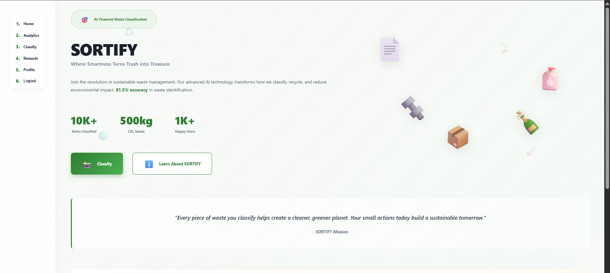
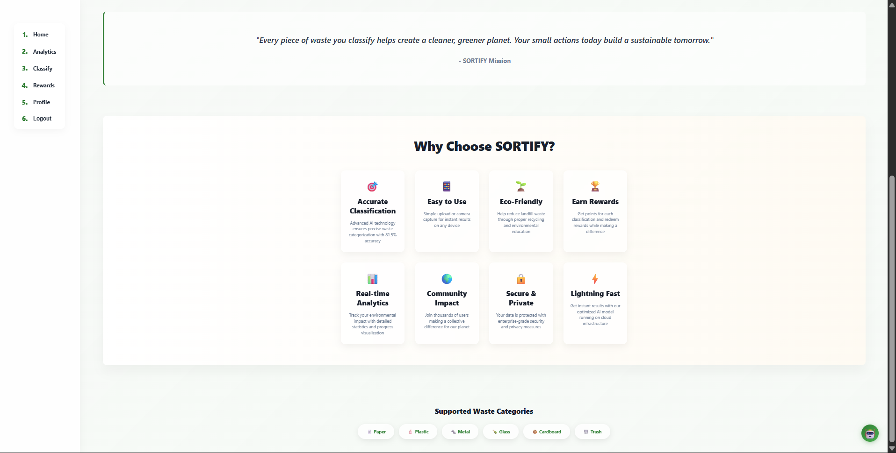

### 🔐 Login
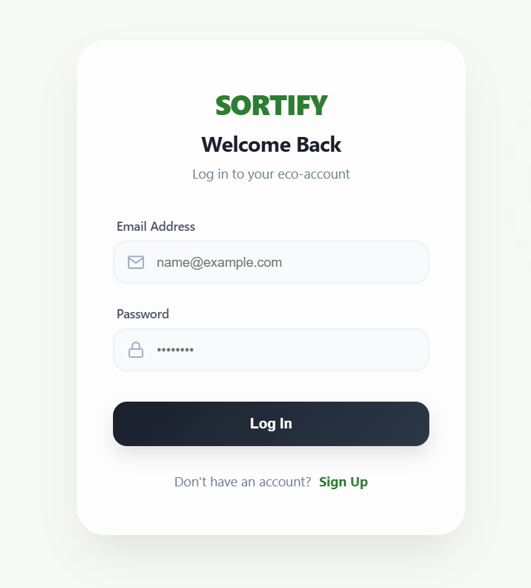

### 📝 Signup
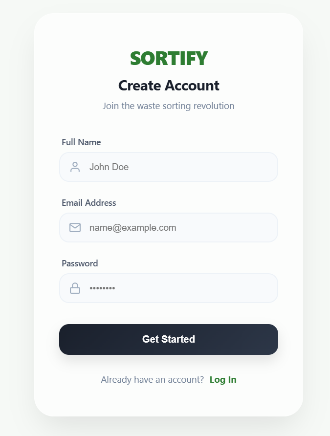

### 👤 Profile
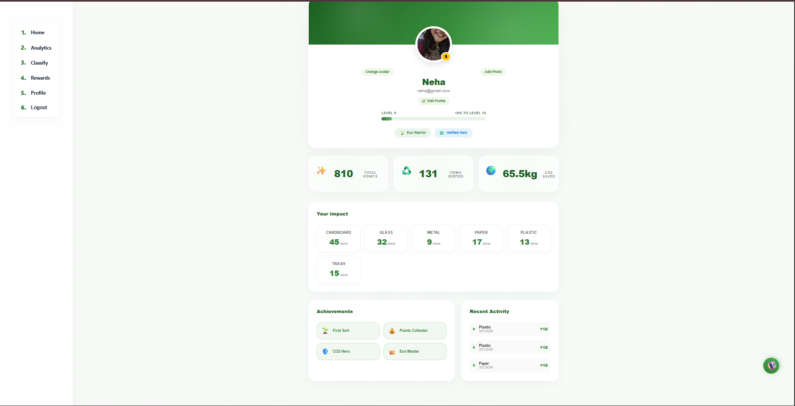

### 📤 Upload & Classify
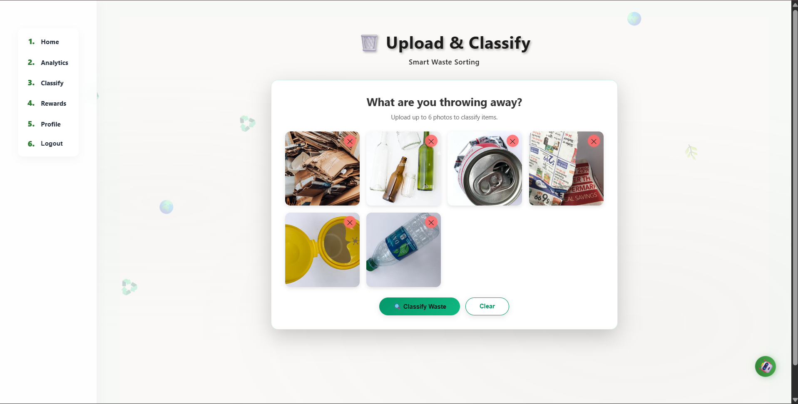
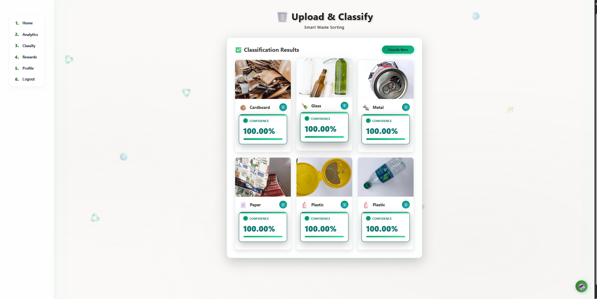

### 📊 Dashboard
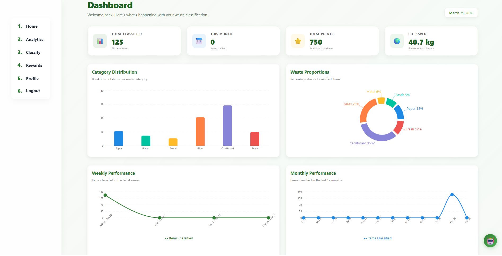
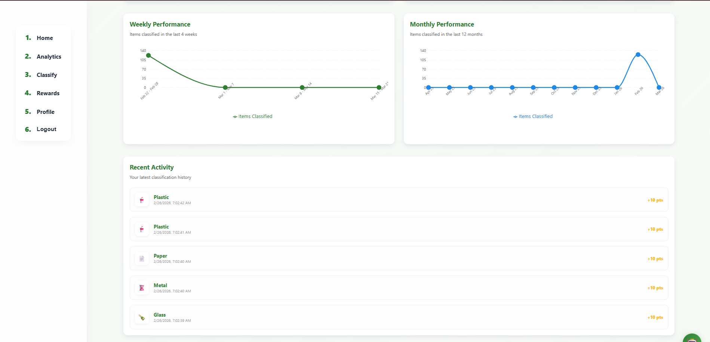

### 🎁 Rewards
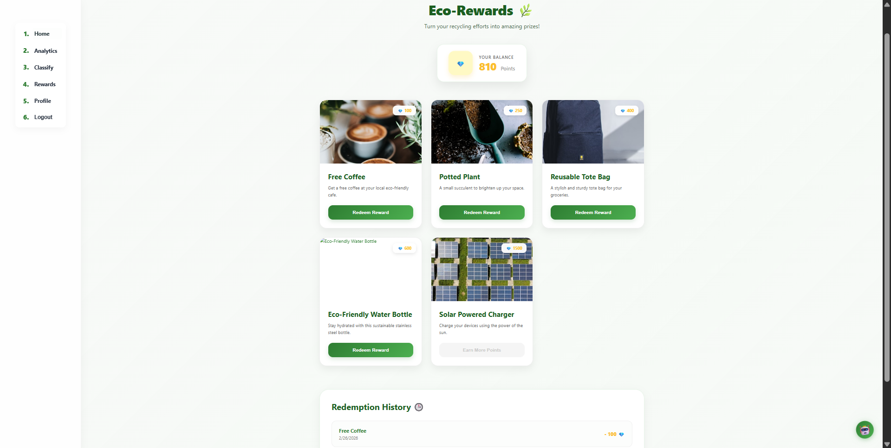

### 🤖 Chatbot
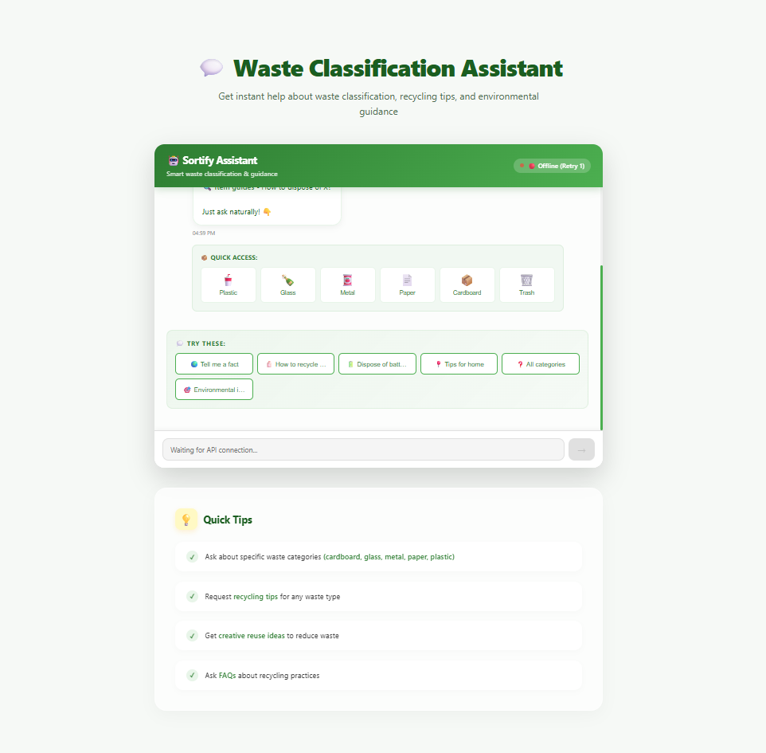
---

# 🚀 Setup Guide

## ⚡ Quick Start

Run these in separate terminals:

* Backend → `cd backend && python app.py`
* Chatbot → `cd chatbot && python chatbot_api.py`
* Frontend → `cd frontend && npm run dev`

---

## 📋 Prerequisites

Before you begin, ensure you have the following installed:

1. **Python 3.9+**: https://www.python.org/downloads/
2. **Node.js & npm**: https://nodejs.org/
3. **MongoDB Community Server**: https://www.mongodb.com/try/download/community

---

## 🧠 Step 1: Backend Setup

1. Open a terminal and navigate to the backend directory:

   ```bash
   cd backend
   ```

2. Create a virtual environment:

   ```bash
   python -m venv venv
   ```

3. Activate the virtual environment:

   * Windows: `venv\Scripts\activate`
   * Mac/Linux: `source venv/bin/activate`

4. Install dependencies:

   ```bash
   pip install -r requirements.txt
   ```

5. Seed the database (make sure MongoDB is running):

   ```bash
   python seed_rewards.py
   ```

6. Start the backend server:

   ```bash
   python app.py
   ```

---

## 🤖 Step 2: Chatbot Setup

1. Open a new terminal and navigate to the chatbot directory:

   ```bash
   cd chatbot
   ```

2. Install dependencies:

   ```bash
   pip install -r requirements.txt
   ```

3. Start the chatbot API:

   ```bash
   python chatbot_api.py
   ```

---

## 🎨 Step 3: Frontend Setup

1. Open a new terminal and navigate to the frontend directory:

   ```bash
   cd frontend
   ```

2. Install dependencies:

   ```bash
   npm install
   ```

3. Start the development server:

   ```bash
   npm run dev
   ```

---

## 📡 Running Services

Make sure all services are running simultaneously:

* Frontend → http://localhost:5173
* Backend → http://localhost:5000
* Chatbot → http://localhost:5001
* MongoDB → mongodb://localhost:27017

---

## 📌 Notes

* Ensure MongoDB is running before starting the backend
* Use separate terminals for backend, chatbot, and frontend
* Virtual environment folders (venv/.venv) should not be uploaded to GitHub
